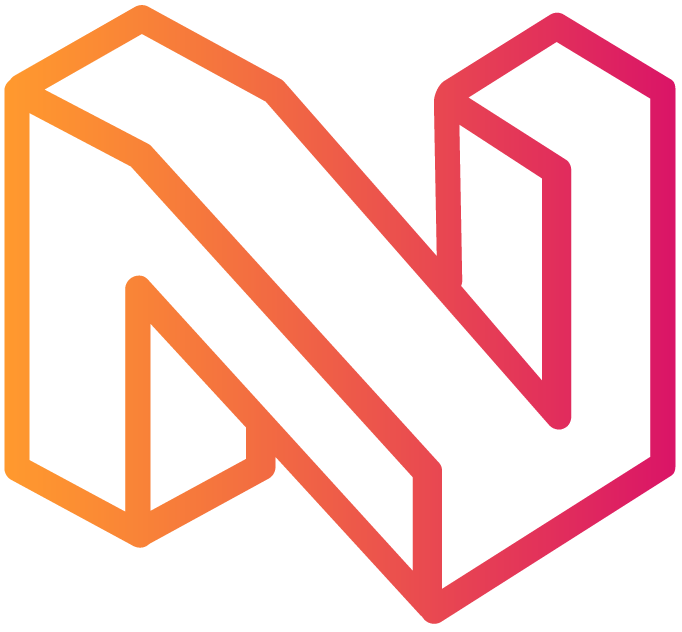

Neuraxle Pipelines
==================

Code Machine Learning Pipelines - The Right Way.

.. image:: https://img.shields.io/github/workflow/status/Neuraxio/Neuraxle/Test%20Python%20Package/master?   :alt: Build
    :target: https://github.com/Neuraxio/Neuraxle

.. image:: https://img.shields.io/gitter/room/Neuraxio/Neuraxle?   :alt: Gitter
    :target: https://gitter.im/Neuraxle/community

.. image:: https://img.shields.io/pypi/l/neuraxle?   :alt: PyPI - License
    :target: https://www.neuraxle.org/stable/Neuraxle/README.html#license

.. image:: https://img.shields.io/pypi/dm/neuraxle?   :alt: PyPI - Downloads
    :target: https://pypi.org/project/neuraxle/

.. image:: https://img.shields.io/github/v/release/neuraxio/neuraxle?   :alt: GitHub release (latest by date)
    :target: https://pypi.org/project/neuraxle/

.. image:: https://img.shields.io/codacy/grade/d56d39746e29468bac700ee055694192?   :alt: Codacy
    :target: https://www.codacy.com/gh/Neuraxio/Neuraxle/dashboard

Neuraxle is a Machine Learning (ML) library for building clean machine learning pipelines using the right abstractions.

- **Component-Based**: Build encapsulated steps, then compose them to build complex pipelines.
- **Evolving State**: Each pipeline step can fit, and evolve through the learning process
- **Hyperparameter Tuning**: Optimize your pipelines using AutoML, where each pipeline step has their own hyperparameter space.
- **Compatible**: Use your favorite machine learning libraries inside and outside Neuraxle pipelines.
- **Production Ready**: Pipeline steps can manage how they are saved by themselves, and the lifecycle of the objects allow for train, and test modes.
- **Streaming Pipeline**: Transform data in many pipeline steps at the same time in parallel using multiprocessing Queues.

Documentation
-------------

You can find the Neuraxle documentation `on the website <https://www.neuraxle.org/stable/index.html>`_. It also contains multiple examples demonstrating some of its features.

Installation
------------

Simply do:

.. code:: bash

    pip install neuraxle

Examples
~~~~~~~~~~~~~~~~~~~~~~~~~~~~~~~~~

We have several `examples on the website <https://www.neuraxle.org/stable/examples/index.html>`__.

For example, you can build a time series processing pipeline as such:

.. code:: python

    p = Pipeline([
        TrainOnlyWrapper(DataShuffler()),
        WindowTimeSeries(),
        
    ])

    # Load data
    X_train, y_train, X_test, y_test = generate_classification_data()

    # The pipeline will learn on the data and acquire state.
    p = p.fit(X_train, y_train)

    # Once it learned, the pipeline can process new and
    # unseen data for making predictions.
    y_test_predicted = p.predict(X_test)

You can also tune your hyperparameters using AutoML algorithms such as the TPE:

.. code:: python

    # Define classification models with hyperparams.

    # All SKLearn models can be used and compared to each other.
    # Define them an hyperparameter space like this:
    decision_tree_classifier = SKLearnWrapper(
        DecisionTreeClassifier(),
        HyperparameterSpace({
            'criterion': Choice(['gini', 'entropy']),
            'splitter': Choice(['best', 'random']),
            'min_samples_leaf': RandInt(2, 5),
            'min_samples_split': RandInt(2, 4)
        }))

    # More SKLearn models can be added (code details skipped):
    random_forest_classifier = ...
    logistic_regression = ...

    # It's possible to mix TensorFlow models into Neuraxle as well, 
    # using Neuraxle-Tensorflow' Tensorflow2ModelStep class, passing in
    # the TensorFlow functions like create_model and create_optimizer:
    minibatched_tensorflow_classifier = EpochRepeater(MiniBatchSequentialPipeline([
            Tensorflow2ModelStep(
                create_model=create_linear_model,
                create_optimizer=create_adam_optimizer,
                create_loss=create_mse_loss_with_regularization
            ).set_hyperparams_space(HyperparameterSpace({
                'hidden_dim': RandInt(6, 750),
                'layers_stacked_count': RandInt(1, 4),
                'lambda_loss_amount': Uniform(0.0003, 0.001),
                'learning_rate': Uniform(0.001, 0.01),
                'window_size_future': FixedHyperparameter(sequence_length),
                'output_dim': FixedHyperparameter(output_dim),
                'input_dim': FixedHyperparameter(input_dim)
            }))
        ]), epochs=42)

    # Define a classification pipeline that lets the AutoML loop choose one of the classifier.
    # See also ChooseOneStepOf documentation: https://www.neuraxle.org/stable/api/steps/neuraxle.steps.flow.html#neuraxle.steps.flow.ChooseOneStepOf
    pipeline = Pipeline([
        ChooseOneStepOf([
            decision_tree_classifier,
            random_forest_classifier,
            logistic_regression,
            minibatched_tensorflow_classifier,
        ])
    ])

    # Create the AutoML loop object.
    # See also AutoML documentation: https://www.neuraxle.org/stable/api/metaopt/neuraxle.metaopt.auto_ml.html#neuraxle.metaopt.auto_ml.AutoML
    auto_ml = AutoML(
        pipeline=pipeline,
        hyperparams_optimizer=TreeParzenEstimator(
            # This is the TPE as in Hyperopt.
            number_of_initial_random_step=20,
        ),
        validation_splitter=ValidationSplitter(validation_size=0.20),
        scoring_callback=ScoringCallback(accuracy_score, higher_score_is_better=True),
        n_trials=40,
        epochs=1,  # Could be higher if only TF models were used.
        hyperparams_repository=HyperparamsOnDiskRepository(cache_folder=neuraxle_dashboard),
        refit_best_trial=True,
        continue_loop_on_error=False
    )

    # Load data, and launch AutoML loop!
    X_train, y_train, X_test, y_test = generate_classification_data()
    auto_ml = auto_ml.fit(X_train, y_train)

    # Get the model from the best trial, and make predictions using predict, as per the `refit_best_trial=True` argument to AutoML.
    y_pred = auto_ml.predict(X_test)

    accuracy = accuracy_score(y_true=y_test, y_pred=y_pred)
    print("Test accuracy score:", accuracy)

--------------
Why Neuraxle ?
--------------

Most research projects don't ever get to production. However, you want
your project to be production-ready and already adaptable (clean) by the
time you finish it. You also want things to be simple so that you can
get started quickly. Read more about `the why of Neuraxle here. <https://github.com/Neuraxio/Neuraxle/blob/master/Why%20Neuraxle.rst>`_

---------
Community
---------

For **technical questions**, please post them on
`StackOverflow <https://stackoverflow.com/questions/tagged/neuraxle>`__
using the ``neuraxle`` tag. The StackOverflow question will automatically
be posted in `Neuraxio's Slack
workspace <https://join.slack.com/t/neuraxio/shared_invite/zt-8lyw42c5-4PuWjTT8dQqeFK3at1s_dQ>`__ and our `Gitter <https://gitter.im/Neuraxle/community>`__ in the #Neuraxle channel. 

For **suggestions, feature requests, and error reports**, please
open an `issue <https://github.com/Neuraxio/Neuraxle/issues>`__.

For **contributors**, we recommend using the PyCharm code editor and to
let it manage the virtual environment, with the default code
auto-formatter, and using pytest as a test runner. To contribute, first
fork the project, then do your changes, and then open a pull request in
the main repository. Please make your pull request(s) editable, such as
for us to add you to the list of contributors if you didn't add the
entry, for example. Ensure that all tests run before opening a pull
request. You'll also agree that your contributions will be licensed
under the `Apache 2.0
License <https://github.com/Neuraxio/Neuraxle/blob/master/LICENSE>`__,
which is required for everyone to be able to use your open-source
contributions.

Finally, you can as well join our `Slack
workspace <https://join.slack.com/t/neuraxio/shared_invite/zt-8lyw42c5-4PuWjTT8dQqeFK3at1s_dQ>`__ and our `Gitter <https://gitter.im/Neuraxle/community>`__ to collaborate with us. We <3 collaborators. You can also subscribe to our mailing list where we will post some `updates and news <https://www.neuraxle.org/stable/intro.html>`__. 

License
~~~~~~~

Neuraxle is licensed under the `Apache License, Version
2.0 <https://github.com/Neuraxio/Neuraxle/blob/master/LICENSE>`__.

Citation
~~~~~~~~~~~~

You may cite our `extended abstract <https://www.researchgate.net/publication/337002011_Neuraxle_-_A_Python_Framework_for_Neat_Machine_Learning_Pipelines>`__ that was presented at the Montreal Artificial Intelligence Symposium (MAIS) 2019. Here is the bibtex code to cite:

.. code:: bibtex

    @misc{neuraxle,
    author = {Chevalier, Guillaume and Brillant, Alexandre and Hamel, Eric},
    year = {2019},
    month = {09},
    pages = {},
    title = {Neuraxle - A Python Framework for Neat Machine Learning Pipelines},
    doi = {10.13140/RG.2.2.33135.59043}
    }

Contributors
~~~~~~~~~~~~

Thanks to everyone who contributed to the project:

-  Guillaume Chevalier: https://github.com/guillaume-chevalier
-  Alexandre Brillant: https://github.com/alexbrillant
-  Éric Hamel: https://github.com/Eric2Hamel
-  Jérôme Blanchet: https://github.com/JeromeBlanchet
-  Michaël Lévesque-Dion: https://github.com/mlevesquedion
-  Philippe Racicot: https://github.com/Vaunorage
-  Neurodata: https://github.com/NeuroData-ltd
-  Klaimohelmi: https://github.com/Klaimohelmi
-  Vincent Antaki: https://github.com/vincent-antaki

Supported By
~~~~~~~~~~~~

We thank these organisations for generously supporting the project:

-  Neuraxio Inc.: https://github.com/Neuraxio

.. raw:: html

    

-  Umanéo Technologies Inc.: https://www.umaneo.com/

.. raw:: html

    

-  Solution Nexam Inc.: https://nexam.io/

.. raw:: html

    

-  La Cité, LP: https://www.lacitelp.com/accueil

.. raw:: html

    

-  Kimoby: https://www.kimoby.com/

.. raw:: html

    
